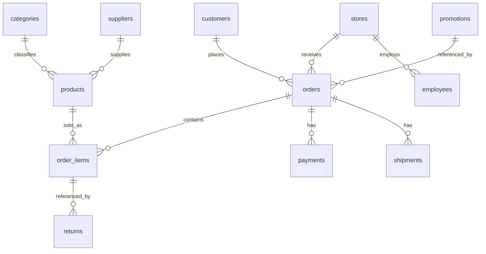

# Data Dictionary and Relationships

Definitions below are inferred from field names and observed values. Source-authored business definitions are unavailable. Detailed raw profiles are in `outputs/quality/column_profile.csv`.

## categories

30 rows. Primary key: `category_id`.

| Column | Type | Role | Interpretation |
| --- | --- | --- | --- |
| category_id | integer | Primary key | Identifier linking to the named entity |
| category_name | text | Attribute | Anonymous category label |

## customers

50,000 rows. Primary key: `customer_id`.

| Column | Type | Role | Interpretation |
| --- | --- | --- | --- |
| customer_id | integer | Primary key | Identifier linking to the named entity |
| city | text | Attribute | Customer or store city as recorded |
| signup_date | date (CSV text) | Attribute | Recorded customer signup date; chronology is inconsistent with many orders |

## employees

1,000 rows. Primary key: `employee_id`.

| Column | Type | Role | Interpretation |
| --- | --- | --- | --- |
| employee_id | integer | Primary key | Identifier linking to the named entity |
| store_id | integer | Foreign key | Identifier linking to the named entity |
| salary | integer | Attribute | Recorded employee salary; pay period and currency unknown |

## order_items

600,000 rows. Primary key: `order_item_id`.

| Column | Type | Role | Interpretation |
| --- | --- | --- | --- |
| order_item_id | integer | Primary key | Identifier linking to the named entity |
| order_id | integer | Foreign key | Identifier linking to the named entity |
| product_id | integer | Foreign key | Identifier linking to the named entity |
| qty | integer | Attribute | Number of units in the item row |
| price | integer | Attribute | Recorded price; unit-price interpretation used for items, catalog price for products |

## orders

300,000 rows. Primary key: `order_id`.

| Column | Type | Role | Interpretation |
| --- | --- | --- | --- |
| order_id | integer | Primary key | Identifier linking to the named entity |
| customer_id | integer | Foreign key | Identifier linking to the named entity |
| store_id | integer | Foreign key | Identifier linking to the named entity |
| order_date | date (CSV text) | Attribute | Recorded order date |
| promotion_id | integer | Foreign key | Identifier linking to the named entity |

## payments

300,000 rows. Primary key: `payment_id`.

| Column | Type | Role | Interpretation |
| --- | --- | --- | --- |
| payment_id | integer | Primary key | Identifier linking to the named entity |
| order_id | integer | Foreign key | Identifier linking to the named entity |
| amount | integer | Attribute | Recorded payment amount; does not reconcile with item sales |

## products

10,000 rows. Primary key: `product_id`.

| Column | Type | Role | Interpretation |
| --- | --- | --- | --- |
| product_id | integer | Primary key | Identifier linking to the named entity |
| category_id | integer | Foreign key | Identifier linking to the named entity |
| supplier_id | integer | Foreign key | Identifier linking to the named entity |
| price | integer | Attribute | Recorded price; unit-price interpretation used for items, catalog price for products |

## promotions

50 rows. Primary key: `promotion_id`.

| Column | Type | Role | Interpretation |
| --- | --- | --- | --- |
| promotion_id | integer | Primary key | Identifier linking to the named entity |
| discount | integer | Attribute | Promotion discount field; units and application unknown |

## returns

30,000 rows. Primary key: `return_id`.

| Column | Type | Role | Interpretation |
| --- | --- | --- | --- |
| return_id | integer | Primary key | Identifier linking to the named entity |
| order_item_id | integer | Foreign key | Identifier linking to the named entity |
| refund | integer | Attribute | Recorded refund amount; returned quantity and event date absent |

## shipments

300,000 rows. Primary key: `shipment_id`.

| Column | Type | Role | Interpretation |
| --- | --- | --- | --- |
| shipment_id | integer | Primary key | Identifier linking to the named entity |
| order_id | integer | Foreign key | Identifier linking to the named entity |
| status | text | Attribute | Recorded shipment status: delivered, shipped or late |

## stores

100 rows. Primary key: `store_id`.

| Column | Type | Role | Interpretation |
| --- | --- | --- | --- |
| store_id | integer | Primary key | Identifier linking to the named entity |
| city | text | Attribute | Customer or store city as recorded |

## suppliers

200 rows. Primary key: `supplier_id`.

| Column | Type | Role | Interpretation |
| --- | --- | --- | --- |
| supplier_id | integer | Primary key | Identifier linking to the named entity |
| country | text | Attribute | Supplier country as recorded |

## Relationships

The diagram describes join directions and allows multiple child records. Observed payments and shipments are one per order in this snapshot. Some orders have no items. An order item may have multiple return records. All 11 foreign-key checks pass.
