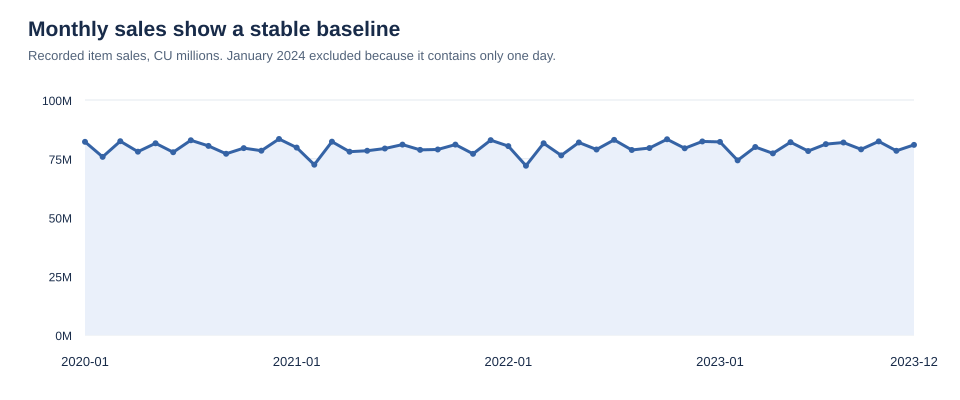

# Retail Sales & Customer Analytics

A reproducible portfolio analysis of **1,591,380 records across 12 relational tables**, covering **January 2020 through January 1, 2024**. The project examines sales, customers, products, stores, returns and shipping while distinguishing valid calculations from unresolved business definitions.

## Start here

- **[Final report](reports/final_report.md):** business questions, findings, charts, recommendations and limitations.
- **[Visual HTML report](reports/retail_analysis.html):** open locally in a browser; charts and styling are embedded, with no internet dependency. GitHub's file viewer displays HTML source; download the project to view the rendered report.
- **[Methodology and KPIs](docs/methodology.md):** populations, denominators, assumptions and cleaning decisions.
- **[Data dictionary and relationships](docs/data_dictionary.md):** tables, columns, keys and model diagram.
- **[Power BI model and DAX](powerbi/README.md):** implementation guide and prepared import tables. A native `.pbix` is not included.



## Main findings

| Metric | Result |
|---|---:|
| Recorded item sales | 3,827,746,136 currency units |
| Order headers | 300,000 |
| Orders with items | 259,233 |
| Sales-backed average order value | 14,765.66 currency units |
| Customers with an item-backed purchase | 49,751 |
| Units sold | 1,500,518 |
| Returned-item rate | 4.88% |
| Returned-order rate | 10.72% |

- **Sales are stable:** 2023 recorded item sales increased 0.02% versus 2022.
- **Category sales are spread broadly:** Cat_5 leads with 3.57% of sales.
- **Repeat buying is common over the full period:** 97.14% of sales-backed customers made at least two purchases. This is not annual retention.
- **Data quality changes the interpretation:** 40,767 order headers have no items, 120,020 orders predate signup, and 7,498 returned items have cumulative refunds above recorded sales.
- **Revenue needs a documented definition:** payments differ from item sales on 299,990 orders. Sales less refunds is an arithmetic scenario, not verified net revenue.

Amounts are labeled **currency units (CU)** because the source does not identify a currency. January 2024 contains only one day and is excluded from full-period growth comparisons. The analysis retains anonymous category labels instead of inventing product descriptions.

## Workflow and evidence

| Stage | Deliverable |
|---|---|
| 1. Business problem | Questions and decisions in the final report and methodology |
| 2. Understand data | Data dictionary, relationship diagram and source manifest |
| 3. Investigate quality | Column profiles, checks and row-level exception exports |
| 4. Clean and prepare | Non-destructive SQL views, date parsing, explicit issue flags and join-safe facts |
| 5. Analyze / EDA | Monthly, annual, product, category, store, customer and promotion summaries |
| 6. Define KPIs | KPI dictionary and machine-readable results |
| 7. Visualize | Six SVG charts and the HTML report |
| 8. Extract insights | Evidence-based interpretations with limits |
| 9. Recommend actions | Prioritized investigation and experiment proposals |
| 10. Report | Executive summary through methodology in Markdown and HTML |

## Reproduce

Requires Python 3.10+ with pandas and NumPy. From the project root:

```powershell
python -m pip install -r requirements.txt
python scripts/analyze.py
python scripts/build_report.py
```

Open `reports/retail_analysis.html` in a browser. The first script reads the supplied CSVs, writes prepared tables and quality evidence, builds a disposable SQLite database, executes the shared SQL, and verifies its results. The second builds the report and SVG charts. Raw CSVs are never modified. The report narrative is tailored to this snapshot; review period labels, narrative and recommendations when replacing the source data.

### SQL workflow

1. Load the CSVs into a database using the column names and types in the dictionary.
2. Run `sql/01_data_exploration.sql` for the original MySQL exploration.
3. Run `sql/01b_data_quality.sql` for additional business-rule checks.
4. Run `sql/02_data_cleaning.sql` to create preparation views.
5. Run `sql/03_business_analysis.sql` for KPIs and business summaries.

The new quality, preparation and analysis SQL uses portable syntax for SQLite and MySQL 8+. It was executed in SQLite; a live MySQL server was not used. The Python run also executes the quality SQL and verifies the preparation and business analysis. Original exploration notes remain in `analysis_notes.md` as a historical record. Final definitions supersede their preliminary KPIs.

## Project structure

```text
data/                Original 12 CSV tables
sql/                 Exploration, quality checks, preparation views and analysis
scripts/             Reproducible analysis and report generation
docs/                Data dictionary, methodology and KPI definitions
outputs/quality/     Source hashes, profiles, checks and exception evidence
outputs/tables/      Prepared facts and analytical summaries
outputs/kpis.json    Exact headline results
outputs/validation.json  Verification outcome
reports/             Final Markdown and HTML reports
screenshots/         SVG charts and a rendered report preview
powerbi/             Model specification and DAX measures
```

## Skills demonstrated

Relational modeling, SQL joins and CTEs, grain-aware aggregation, referential-integrity checks, business-rule validation, pandas preparation, KPI definition, descriptive analysis, visual reporting, reconciliation and analytical communication. The Power BI model specification and DAX provide a next implementation step; they have not been executed in Power BI.

## Source and limitations

The original project identifies **Kaggle** as the source. The exact dataset URL, creator, license, currency and generator documentation are not supplied. Add the original source citation and verify redistribution terms before publishing source files. This project has not been published externally.

The records appear consistent with generated data, but that provenance is unconfirmed. Cost, payment method, return reason/quantity/date, promised delivery date and delivery timestamps are absent. These gaps prevent profit/margin, payment-method comparisons, unit return rates, causal return explanations and validated delivery-duration analysis.
