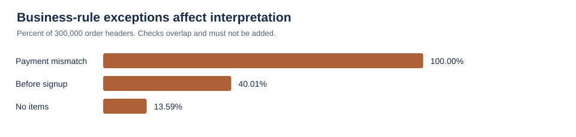
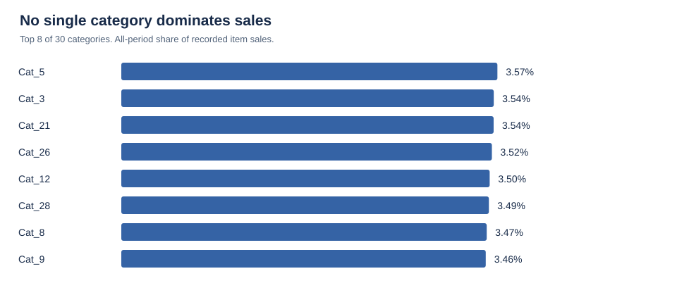
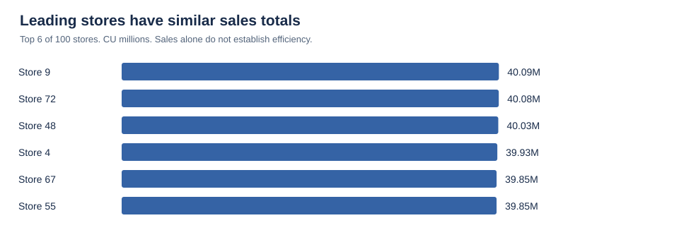
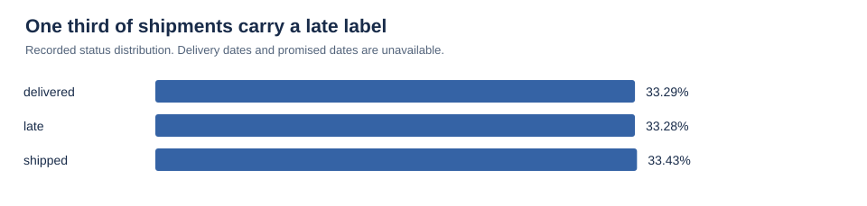

# Retail Sales & Customer Analytics

Source period: 2020-01-01 to 2024-01-01. Amounts in unspecified currency units (CU).

## Executive Summary

Recorded item sales total **3,827,746,136 CU** across **259,233 orders with items** from 2020-01-01 to 2024-01-01. This is an analytical sales measure based on quantity times transaction price. Its accounting treatment and currency are undocumented.

- Full-year 2023 sales were **957,899,902 CU**, changing **0.02%** from 2022. The four complete years show a stable baseline.
- **Cat_5** leads with **3.57%** of sales. Its lead is small within a broad category mix.
- **97.14%** of customers with an item-backed purchase bought at least twice during the full period. The top 10% by observed sales contribute **20.88%** of sales.
- The most important prerequisite for business use is reconciliation: **40,767** orders lack items, **120,020** predate signup, and **7,498** items have refunds above recorded sales.

Recommended sequence: resolve transaction definitions and exceptions, establish the sales baseline, then test customer and assortment actions with additional operational data.

## Business Questions

1. How are sales and order values changing over time?
2. Which categories, products, and stores contribute most?
3. How many customers purchase repeatedly, and how concentrated are sales?
4. Which products merit a returns review?
5. Do promotion values explain transaction prices or payments?
6. What can shipment records tell us about fulfillment?

The intended stakeholder is a retail manager deciding where to investigate and what to test. The project demonstrates SQL, data profiling, analytical modeling, KPI design, visualization, and evidence-based communication.

## Dataset Overview

The supplied dataset has **1,591,380 rows across 12 tables**, including 300,000 order headers and 600,000 item rows. The order-date range is **2020-01-01 to 2024-01-01**. The final date contributes only one day to January 2024. Customer signup dates run from 2019-01-01 to 2024-01-01.

| Table | Rows | Grain |
| --- | --- | --- |
| categories | 30 | Category |
| customers | 50,000 | Customer |
| employees | 1,000 | Employee |
| order_items | 600,000 | Order item |
| orders | 300,000 | Order header |
| payments | 300,000 | Payment record |
| products | 10,000 | Product |
| promotions | 50 | Promotion |
| returns | 30,000 | Return record |
| shipments | 300,000 | Shipment record |
| stores | 100 | Store |
| suppliers | 200 | Supplier |

The README identifies Kaggle as the source, but the exact URL and license are missing. The labels and distributions suggest a generated dataset; this is an inference, not verified provenance. See the [data dictionary](../docs/data_dictionary.md) for columns and relationships and the [source manifest](../outputs/quality/source_manifest.csv) for file hashes.

## Data Quality and Cleaning

All supplied columns were checked for missing/blank values, all primary keys for duplicates, and all 11 foreign-key relationships for unmatched records. These structural checks found no exceptions. Valid date formats and tested numeric domains also passed. No text values needed trimming or shipment case correction in this snapshot.

| Finding | Affected | Treatment |
| --- | --- | --- |
| Order headers without items | 40,767 / 300,000 (13.59%) | Retain and flag; exclude from primary AOV denominator |
| Orders before customer signup | 120,020 / 300,000 (40.01%) | Retain sales; withhold signup cohorts |
| Payment differs from item sales | 299,990 / 300,000 | Report payments separately |
| Transaction price differs from catalog | 599,863 / 600,000 | Use recorded transaction price |
| Return records beyond first per item | 749 | Aggregate by item before joining; preserve return IDs |
| Items with cumulative excessive refunds | 7,498 / 29,251 returned items | Retain and flag; withhold verified net revenue |

The excessive-refund items account for **25.63%** of returned items; their aggregate refund excess is **12,602,629 CU**. Repeated item references are not automatically duplicate returns because the return IDs differ.

Preparation preserves every source row, parses dates, derives sales and issue flags, and aggregates each fact before joining. The SQL and Python pipelines validate unique output grains and reconciled sums. [Full audit](../outputs/quality/checks.csv) and [methodology](../docs/methodology.md) provide the evidence and decisions.

## KPI Summary

Headline metrics include all observed dates. Sales-backed means an order has at least one item row. Amounts use CU because currency is unconfirmed.

| KPI | Value | Definition |
| --- | --- | --- |
| Recorded item sales | 3,827,746,136 CU | SUM(qty × transaction price) |
| Order headers | 300,000 | All order IDs |
| Sales-backed orders | 259,233 | Order IDs represented in items |
| Sales-backed AOV | 14,765.66 CU | Sales / sales-backed orders |
| Ordering customers | 49,886 | Customers in headers |
| Sales-backed customers | 49,751 | Customers with item-backed orders |
| Units sold | 1,500,518 | Sum of quantities |
| Returned-item rate | 4.88% | 29,251 distinct returned item IDs / 600,000 items |
| Returned-order rate | 10.72% | 27,792 returned orders / 259,233 sales-backed orders |
| Repeat-buyer rate | 97.14% | At least 2 item-backed orders / sales-backed buyers |
| Sales per customer | 76,938.07 CU | Sales / sales-backed customers |
| Recorded payments | 3,018,080,810 CU | Sum of payment records |
| Recorded refunds | 75,962,300 CU | Sum of return records |

Using all order headers would produce **12,759.15 CU** per header. This differs from the primary AOV because 13.59% of headers have no items. The arithmetic result of sales less recorded refunds is **3,751,783,836 CU**, but it is not verified net revenue. Profit, margin, realized average discount, and unit return rate are unavailable.

## Sales Analysis

| Year | Recorded item sales (CU) | Sales-backed orders | Year-over-year change |
| --- | --- | --- | --- |
| 2020 | 959,634,059 | 65,181 | Baseline |
| 2021 | 950,027,068 | 64,240 | -1.00% |
| 2022 | 957,707,647 | 64,818 | 0.81% |
| 2023 | 957,899,902 | 64,819 | 0.02% |

Full-year sales range from **950,027,068 to 959,634,059 CU**. A flat four-year pattern supports a stable historical baseline; it does not establish a growth forecast. Monthly totals reflect different numbers of days as well as transaction volume, so these charts alone do not prove seasonal demand.

The partial January 2024 extract contains **195 order headers, 175 sales-backed orders, and 2,477,460 CU** of sales. Comparing it with a full month or year would produce a misleading decline. [Monthly detail](../outputs/tables/monthly_sales.csv) includes completeness flags and like-month growth for complete months.

## Customer Analysis

Of 50,000 registered customers, **49,886** appear in order headers and **49,751** have at least one item-backed purchase. There are **114 customers with no order header** and **135 with headers but no item-backed purchase**.

| Observed customer group | Customers | Recorded item sales (CU) |
| --- | --- | --- |
| No item-backed order | 135 | 0 |
| One item-backed order | 1,422 | 21,926,350 |
| Repeat item-backed buyer | 48,329 | 3,805,819,786 |

Repeat buyers contribute **99.43%** of sales. Their **97.14%** repeat rate covers approximately four years, so it should not be presented as annual retention or proof of loyalty.

The top **4,976** sales-backed customers, approximately 10%, account for **20.88%** of sales. This gives a defined group for a retention test without claiming an 80/20 concentration. [Customer summaries](../outputs/tables/customer_summary.csv) include frequency, sales and recency as of **2024-01-02**. Signup dates are excluded from segmentation because 40.01% of orders predate signup.

## Product and Category Analysis

**Cat_5** generates **136,704,132 CU**, or **3.57%** of all sales. Across the 30 categories, shares range from **2.93% to 3.57%**. This is a broad mix, with no dominant category in the extract.

The highest-sales product is **Product 745** in **Cat_18**, with **674,395 CU** across **87 item rows**. Its contribution is just **0.02%** of total sales. A ranking alone is insufficient evidence for a major inventory shift.

Keep the anonymous source labels until a merchandise mapping is supplied. Assess units and return exposure alongside sales. [Category detail](../outputs/tables/category_performance.csv) and [product detail](../outputs/tables/product_performance.csv) contain the full rankings.

## Store Analysis

**Store 9 in Delhi** leads with **40,093,705 CU**, representing **1.05%** of total sales. It has **2,671** item-backed orders and **15,010.75 CU** AOV.

Across 100 stores, sales range from **36,060,894 to 40,093,705 CU**. The top store is only **11.18%** above the lowest by observed sales. Small ranking differences should prompt a closer comparison of order volume, AOV, returns and store context before resources are reassigned.

Store size, opening dates, footfall and operating costs are absent, so revenue rank does not measure productivity or profitability. [Store detail](../outputs/tables/store_performance.csv) supports further review.

## Returns and Shipping Analysis

The **30,000 return records** reference **29,251 distinct item rows** across **27,792 orders**. The returned-item rate is **4.88%** and returned-order rate is **10.72%**. Simply dividing return records by orders would mix grains and overcount repeat return references.

The following products are review candidates among those with at least 50 sold item rows. The threshold is a transparent screening choice, not statistical significance.

| Product | Sold items | Returned items | Returned-item rate |
| --- | --- | --- | --- |
| 6506 | 55 | 12 | 21.82% |
| 7749 | 54 | 11 | 20.37% |
| 474 | 50 | 10 | 20.00% |
| 7752 | 55 | 10 | 18.18% |
| 3429 | 58 | 10 | 17.24% |

Product **6506** has the highest observed rate in this screen, **21.82%** across **55** sold item rows. Small samples and screening 10,000 products can produce extreme rates by chance. Inspect return reasons and additional periods before inferring defects.

**99,855 of 300,000 shipments (33.29%)** are labeled late. This is a status-label share, not a validated on-time-delivery KPI. There are no event timestamps, promised dates, carriers or delivery durations. Returns have no event date, so refund amounts grouped by order date reflect the original sale period, not refund cash flow.

## Promotions and Revenue Reconciliation

All 300,000 orders reference one of 50 promotions. Their order-weighted average `discount` value is **21.9248**, but its unit and realized application are undocumented.

Recorded payments total **3,018,080,810 CU**, which is **809,665,326 CU** below calculated item sales. Only **10 orders** match item sales within 0.01 CU. Applying an illustrative percentage discount to item sales produces **zero matching orders** at that tolerance.

Transaction price and catalog price have Pearson correlation **0.0005**; order item sales and recorded payments have correlation **-0.0007**. These near-zero correlations reinforce the need for source definitions. They do not establish how the dataset was generated.

Use [payment reconciliation](../outputs/quality/payment_reconciliation.csv) to inspect specific orders. Keep promotion comparisons descriptive because there is no unpromoted control group, no campaign dates and no documented eligibility. Do not claim promotion lift or apply an additional discount to the headline sales measure.

## Key Insights

1. **The largest analytical risk is semantic consistency.** Clean keys and complete fields coexist with missing item records, incompatible signup dates and unreconciled monetary facts.
2. **Complete-year sales are stable.** The 2023 change of 0.02% provides little evidence of sustained growth or decline.
3. **Sales are spread across categories and stores.** The largest category contributes 3.57% and the largest store 1.05%.
4. **Repeat purchasing is common over the full period.** The 97.14% rate is descriptive and should not be relabeled as annual retention.
5. **Return rates require a defined grain.** A 4.88% item rate and 10.72% order rate answer different questions.

## Recommendations

| Priority | Evidence | Proposed action | How to assess progress |
|---|---|---|---|
| 1 | 299,990 payment mismatches; 40,767 itemless headers | Ask the source owner for price, payment, tax, freight and order-state definitions; trace sample IDs | Reconciled-order share and unresolved itemless headers |
| 1 | 7,498 returned items have excessive cumulative refunds | Review return IDs against policy and original transactions before defining net revenue | Excess-refund cases with documented explanations or corrections |
| 1 | 120,020 orders predate signup | Validate signup semantics and date-generation rules | Documented resolution of signup inconsistencies |
| 2 | Top customer decile contributes 20.88% of sales | Design a retention test with a randomized holdout after customer data validation | Incremental repeat purchases and contribution after offer costs |
| 2 | Product return-rate outliers with limited samples | Review candidate products using reasons, quantities and subsequent-period evidence | Returned-item rate with exposure and confidence intervals |
| 2 | 33.29% of shipments labeled late | Add dispatch, promised and actual delivery timestamps and carrier data | Validated on-time-delivery rate and transit duration |
| 3 | Stable sales and broadly distributed contributions | Use complete-period sales as a baseline; test assortment changes on a limited scale | Comparable-period sales, stockouts and margin once cost data exist |

These are proposals for investigation and controlled tests. The extract does not support quantified profit improvements or a causal explanation for returns.

## Methodology and Limitations

The process follows business questions, source profiling, quality investigation, preparation, EDA, KPI definition, visualization, interpretation, recommendations and reporting. Original CSVs and exploration notes are preserved. Preparation uses explicit flags and aggregates facts before joins to prevent multiplication of sales and refunds.

Python assertions confirm unique grains, reconciled sales across each summary, payments/refunds against source totals, and distinct return counts. The preparation and business-analysis SQL execute in SQLite, and sales, order and refund totals agree with the pandas calculations. MySQL execution and native Power BI DAX execution have not been performed.

The exact dataset source, license, currency and business definitions remain unconfirmed. Profit/margin, payment-method analysis, delivery duration, return causes and realized discount are unavailable. January 2024 is partial. Refunds have no event dates, and signup inconsistencies prevent defensible acquisition cohorts. The results describe the supplied extract and should not be generalized to a real retailer without validation.

See the [methodology and KPI dictionary](../docs/methodology.md), [data dictionary](../docs/data_dictionary.md), [verification result](../outputs/validation.json), and [Power BI build guide](../powerbi/README.md). Rebuild with `python scripts/analyze.py` followed by `python scripts/build_report.py`.

